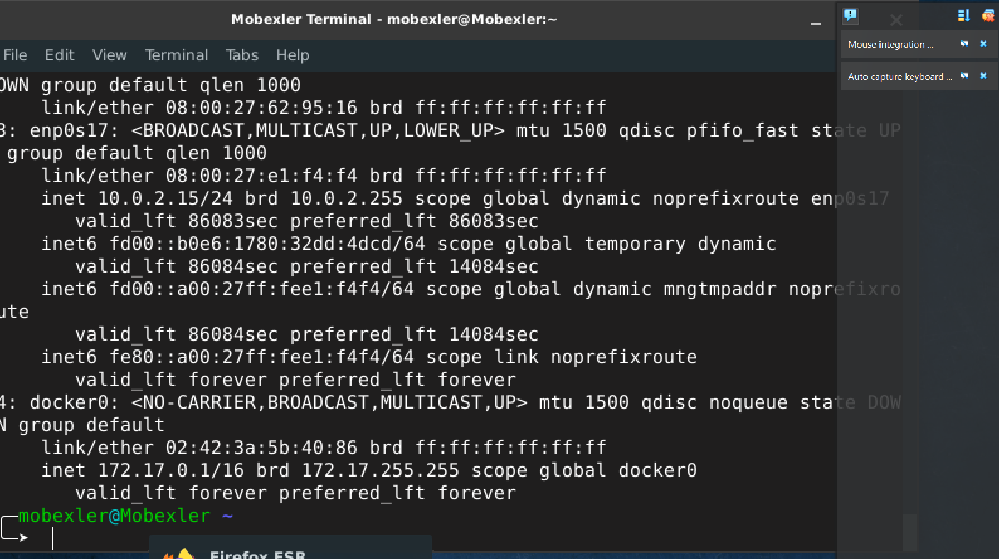
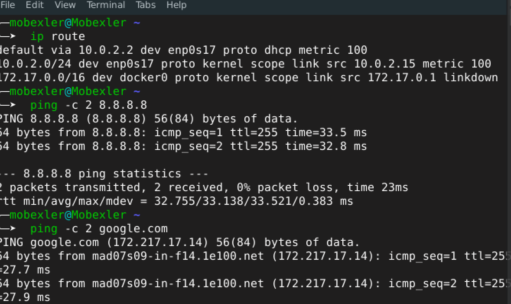
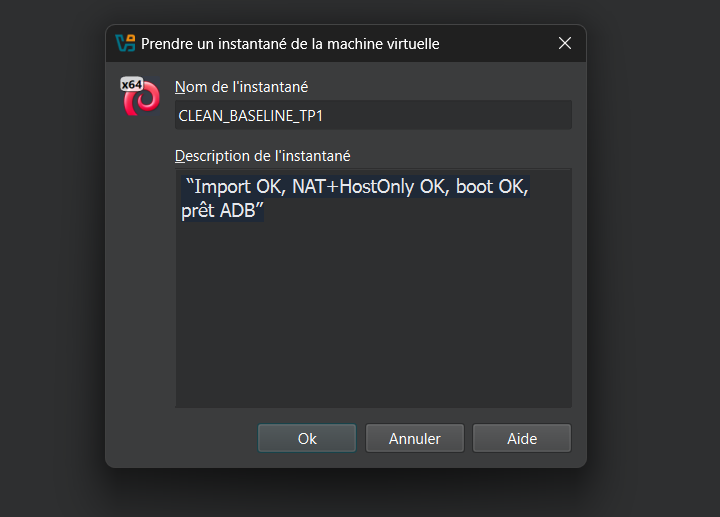

# lab1-mobile
algorithme  SHA256 

adapter 1

adapter 2

connexion a mobile

verification reseau

verification reseau route internet

creation de snapshot

a èpropos l etape 6 je peux pas la realliser car je possede pas une cible android mes j ai bien compris le fonctionnement de l etape 6

